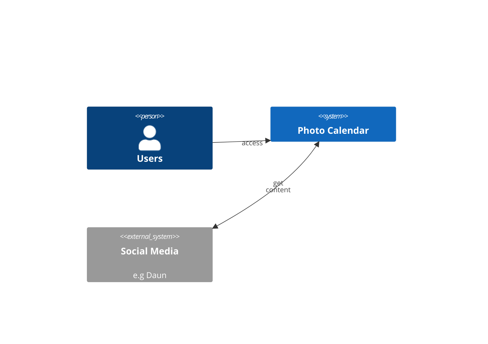
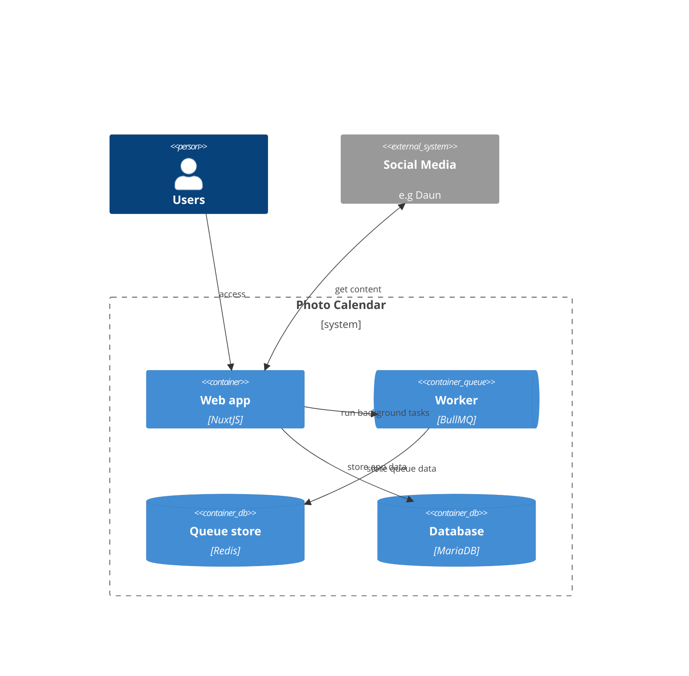
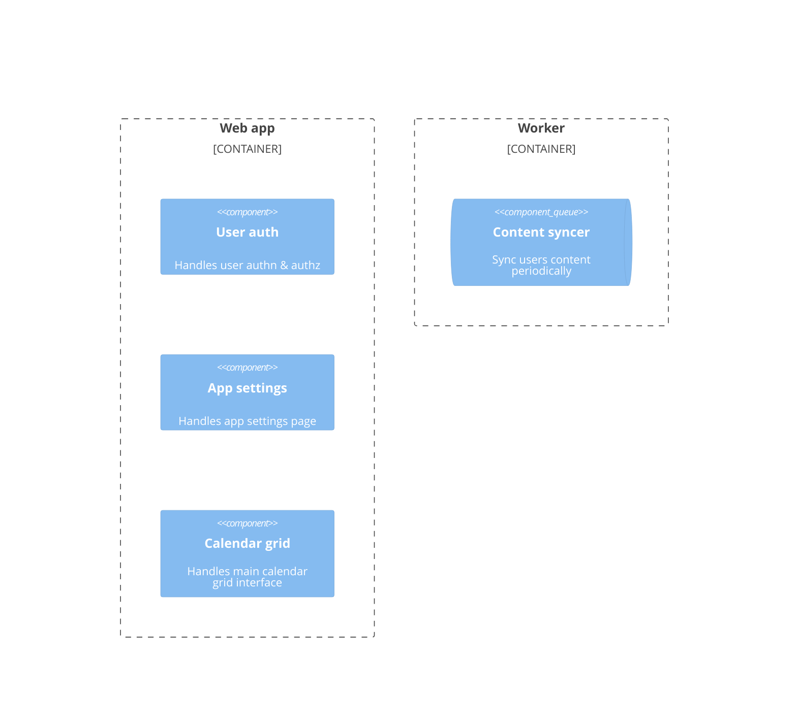
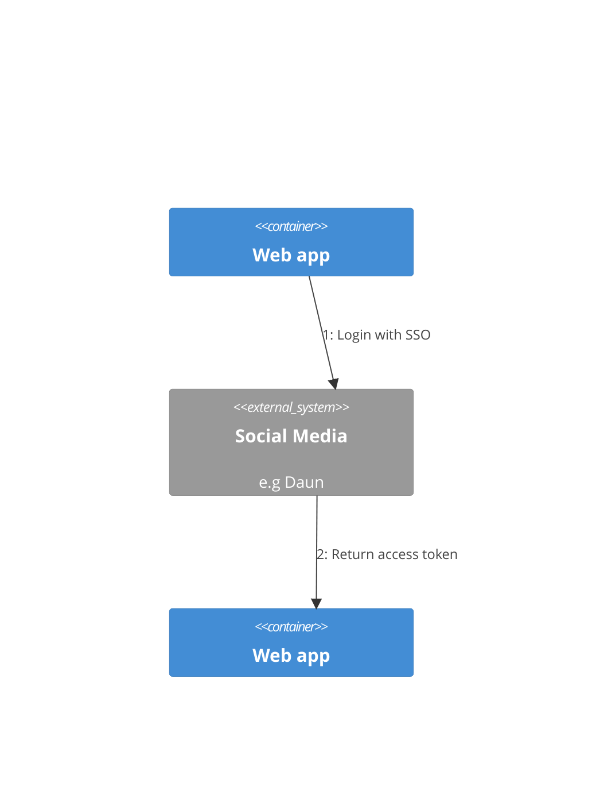
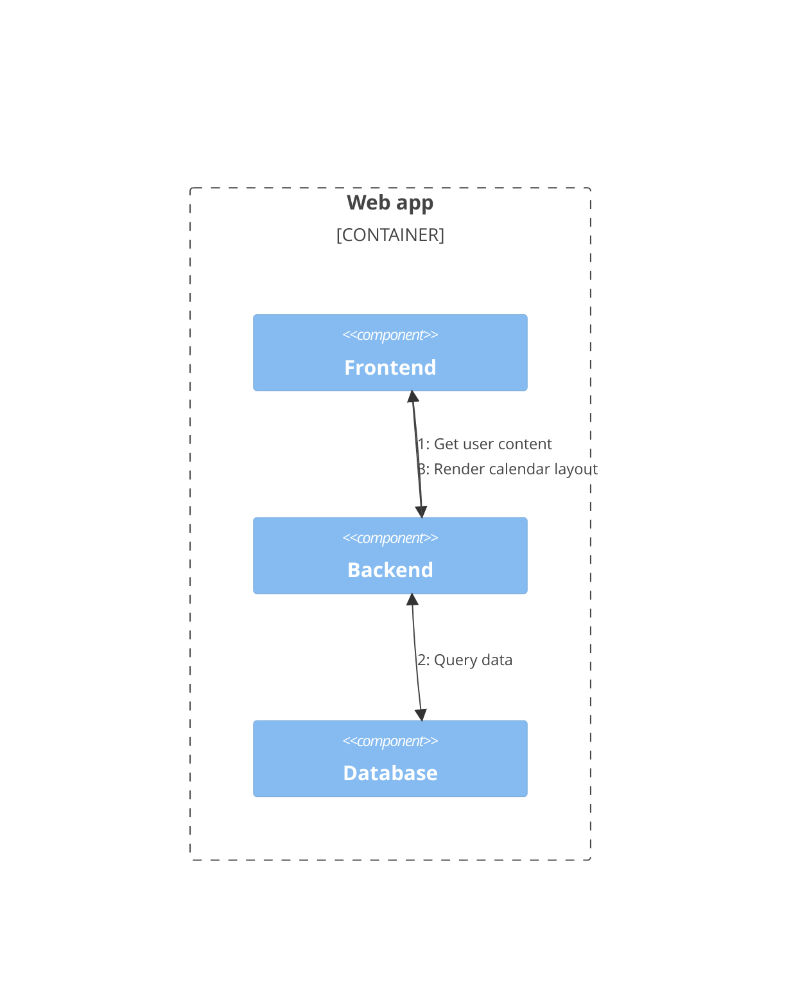
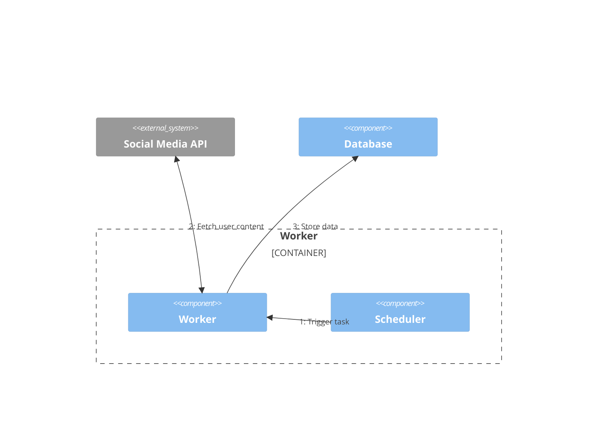
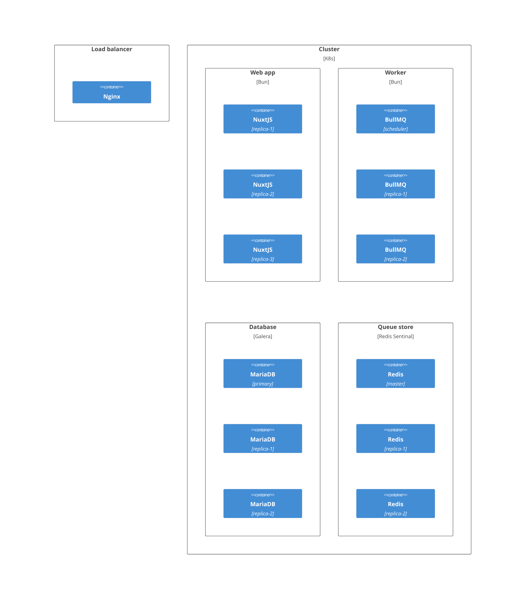
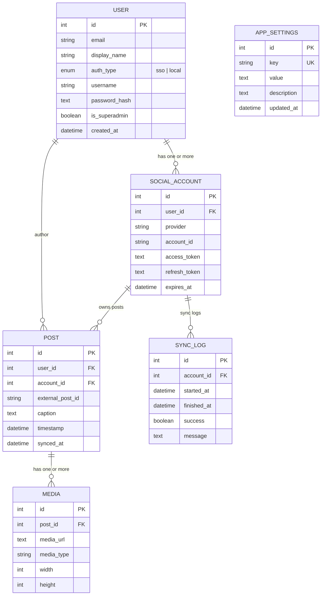

# Software Design Specification

## Context Diagram

## Container Diagram

## Component Diagram

## Dynamic Diagram

### User auth

### Calendar grid

### Content syncer

## Deployment Diagram

## Entity Relationship Diagram

## REST API Endpoints

### Authentication Flow 

`/api/auth/login` (GET)

| Aspect     | Details |
| ---------- | ------- |
| Parameters | <li>`provider` (query, required) → e.g. "google", "azuread", "keycloak" <li>`redirect_uri` (query, optional override) <li>`state` (query, generated server-side) |
| Output     | Redirect to IdP authorization endpoint |
| HTTP Codes | `302` (success redirect)   `400` (invalid request) |

`/api/auth/callback` (GET)

| Aspect     | Details |
| ---------- | ------- |
| Parameters | <li> `provider` (query, required) <li> `code` (query, required) <li> `state` (query, required) |
| Output     | <pre>{ "access_token": "string", "id_token": "string", "refresh_token": "string", "expires_in": 3600 }</pre> |
| HTTP Codes | `200` (success)   `400` (invalid request)   `401` (token exchange failed) |

`/api/auth/token` (POST)

| Aspect     | Details |
| ---------- | ------- |
| Parameters | <li> `provider` (body, required) <li> `grant_type`: "`authorization_code`" or "`refresh_token`" <li> `code` (if grant_type=authorization_code) <li> `refresh_token` (if grant_type=refresh_token) |
| Output     | Same as `/api/auth/callback` |
| HTTP Codes | `200` (success)   `400` (invalid grant_type)   `401` (invalid token) |

`/api/auth/refresh` (POST)

| Aspect     | Details |
| ---------- | ------- |
| Parameters | <li> `provider` (body, required) <li> `refresh_token` (required) |
| Output     | <pre> { "access_token": "string", "expires_in": 3600 } |
| HTTP Codes | `200` (success)   `401` (invalid/expired refresh token) |

`/api/auth/logout` (GET, POST)

| Aspect     | Details |
| ---------- | ------- |
| Parameters | <li> `provider` (query or body, required) <li> `id_token_hint` (optional) |
| Output     | <pre> { "message": "Logged out" } |
| HTTP Codes | `200` (success), `400` (invalid request) |

`/api/auth/userinfo` (GET)

| Aspect     | Details |
| ---------- | ------- |
| Parameters | <li> `Authorization: Bearer` (header, required) <li> `provider` (query, optional — backend can auto‑detect from `iss` claim in token) |
| Output     | <pre> { "sub": "user-id", "name": "Full Name", "email": "user@example.com", "roles": ["admin","user"] } |
| HTTP Codes | `200` (success)   `401` (invalid/expired token) |

### Session & Token Management

`/api/session` (GET)

| Aspect     | Details |
| ---------- | ------- |
| Parameters | <li> `Authorization: Bearer` (header, required) <li> `provider` (query, optional — backend can auto‑detect from `iss`) |
| Output     | <pre> { "user": { "id": "123", "name": "Azwan" }, "expires_at": "2026-02-23T07:22:00Z" } |
| HTTP Codes | `200` (success)   `401` (no active session) |

`/api/session/validate` (POST)

| Aspect     | Details |
| ---------- | ------- |
| Parameters | <li> `token` (body, required) <li> `provider` (body, optional — backend can auto‑detect from `iss`) |
| Output     | <pre> { "valid": true, "claims": { "sub": "123", "exp": 1670000000 } } |
| HTTP Codes | `200` (success)   `401` (invalid token) |

`/api/session/revoke` (GET)

| Aspect     | Details |
| ---------- | ------- |
| Parameters | <li> `token` (body, required) <li> `provider` (body, optional — backend can auto‑detect from `iss`) |
| Output     | <pre> { "message": "Token revoked" } |
| HTTP Codes | `200` (success)   `400` (invalid request) |

### Posts

`/api/posts` (GET)

| Aspect     | Details |
| ---------- | ------- |
| Parameters | <li> `Authorization: Bearer` (header, required) <li> `page` (int, optional) → pagination page number <li> `limit` (int, optional) → number of posts per page <li> `from_timestamp` (datetime, optional) → filter posts newer than this timestamp <li> `to_timestamp` (datetime, optional) → filter posts older than this timestamp <li> `sort` (string, optional: asc|desc) → sort by timestamp |
| Output     | <pre>{    "page": 1,   "limit": 10,   "total": 125,   "posts": [     {       "id": 101,       "external_post_id": "fb_12345",       "caption": "Sunset view!",       "timestamp": "2026-02-20T18:30:00",       "account_id": 5,       "media": [         {           "id": 501,           "media_url": "https://cdn.app/photos/sunset.jpg",           "media_type": "photo",           "width": 1080,           "height": 720         }       ]     }   ] } |
| HTTP Codes | `200` (success)   `400` (invalid request)   `401` (unauthorized)   `404` (no posts found)   `500` (internal server error) |

`/api/posts/{id}` (GET)

| Aspect     | Details |
| ---------- | ------- |
| Parameters | <li> `Authorization: Bearer` (header, required) <li> `id` (int) → Unique identifier of the post |
| Output     | <pre>{   "id": 101,   "external_post_id": "fb_12345",   "caption": "Sunset view!",   "timestamp": "2026-02-20T18:30:00Z",   "account_id": 5,   "media": [     {       "id": 501,       "media_url": "https://cdn.app/photos/sunset.jpg",       "media_type": "photo",       "width": 1080,       "height": 720     },     {       "id": 502,       "media_url": "https://cdn.app/photos/sunset2.jpg",       "media_type": "photo",       "width": 640,       "height": 480     }   ] } |
| HTTP Codes | `200` (success)   `400` (invalid request)   `401` (unauthorized)   `404` (no posts found)   `500` (internal server error) |

### App Settings

`/api/settings` (GET)

| Aspect     | Details |
| ---------- | ------- |
| Parameters | <li> `Authorization: Bearer` (header, required) |
| Output     | <pre>{   "settings": [     {       "key": "sync_interval_minutes",       "value": "30", "description": "Interval for background sync jobs",       "updated_at": "2026-02-22T10:00:00Z"     }   ] } |
| HTTP Codes | `200` (success)   `400` (invalid request)   `401` (unauthorized)   `500` (internal server error) |

`/api/settings/{key}` (GET)

| Aspect     | Details |
| ---------- | ------- |
| Parameters | <li> `Authorization: Bearer` (header, required) <li> `key` (query, required) → app setting key |
| Output     | <pre>{ "key": "sync_interval_minutes", "value": "30", "description": "Interval for background sync jobs", "updated_at": "2026-02-22T10:00:00Z" } |
| HTTP Codes | `200` (success)   `400` (invalid request)   `401` (unauthorized)   `404` (not found)   `500` (internal server error) |

`/api/settings` (POST)

| Aspect     | Details |
| ---------- | ------- |
| Parameters | <li> `Authorization: Bearer` (header, required) <li> JSON body: <pre>{   "key": "max_upload_size_mb",   "value": "50",   "description": "Maximum media upload size"  } |
| Output     | <pre> { "key": "max_upload_size_mb", "value": "50", "description": "Maximum media upload size", "updated_at": "2026-02-23T07:30:00Z" } |
| HTTP Codes | `201` (created)   `400` (invalid request)   `401` (unauthorized)   `500` (internal server error) |

`/api/settings/{key}` (PUT)

| Aspect     | Details |
| ---------- | ------- |
| Parameters | <li> `Authorization: Bearer` (header, required) <li> `key` (query, required) → app setting key <li> JSON Body: <pre>{ "value": "60", "description": "Updated sync interval" } |
| Output | <pre> { "key": "sync_interval_minutes", "value": "60", "description": "Updated sync interval", "updated_at": "2026-02-23T07:35:00Z" } |
| HTTP Codes | `200` (success)   `400` (invalid request)   `401` (unauthorized)   `404` (not found)   `500` (internal server error) |

`/api/settings/{key}` (DELETE)

| Aspect     | Details |
| ---------- | ------- |
| Parameters | <li> `Authorization: Bearer` (header, required) <li> `key` (query, required) → app setting key |
| Output     | <pre> { "message": "Setting 'sync_interval_minutes' deleted successfully." } |
| HTTP Codes | `200` (success)   `400` (invalid request)   `401` (unauthorized)   `404` (not found)   `500` (internal server error) |
