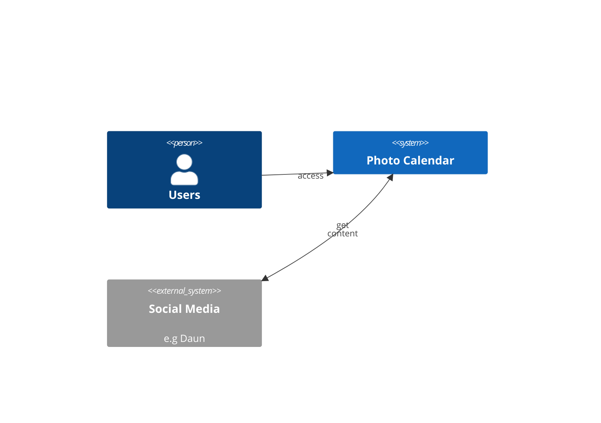
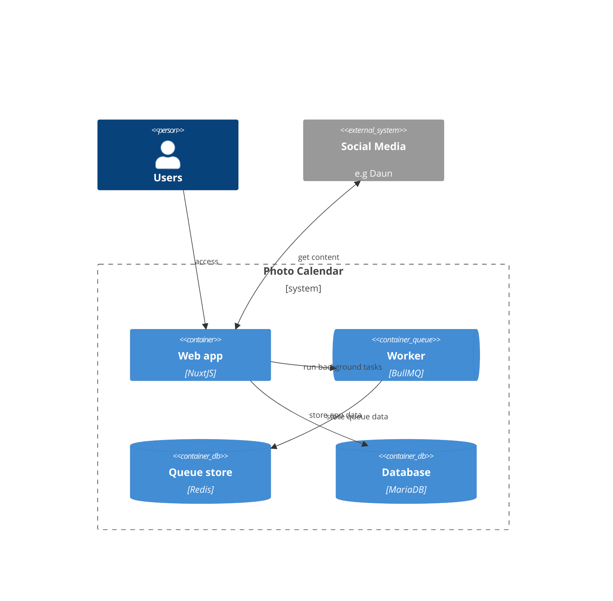
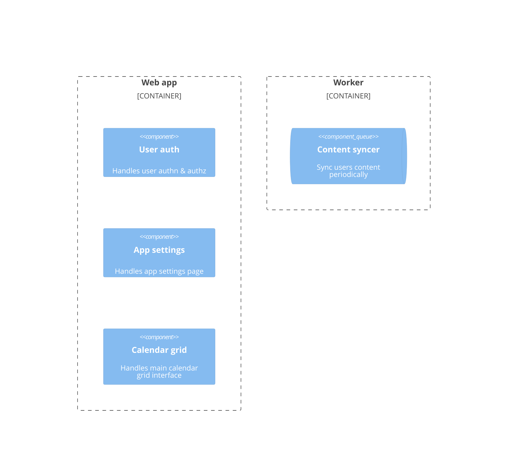
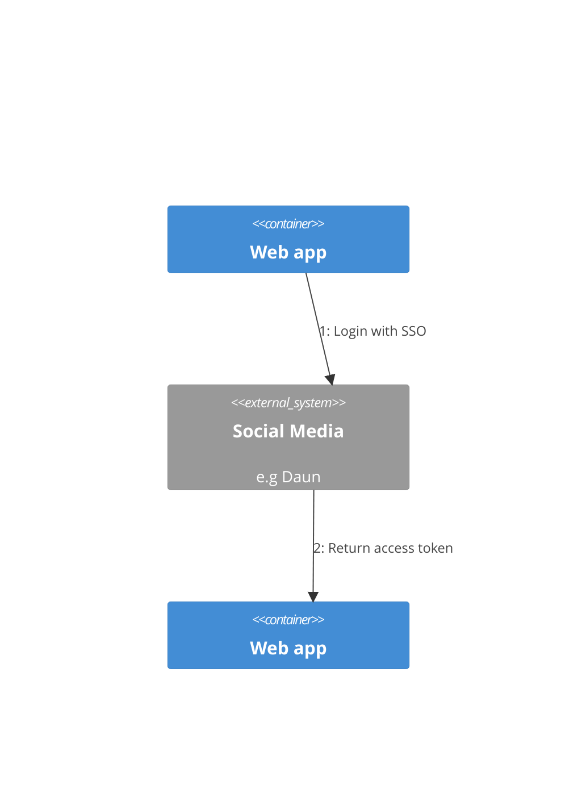
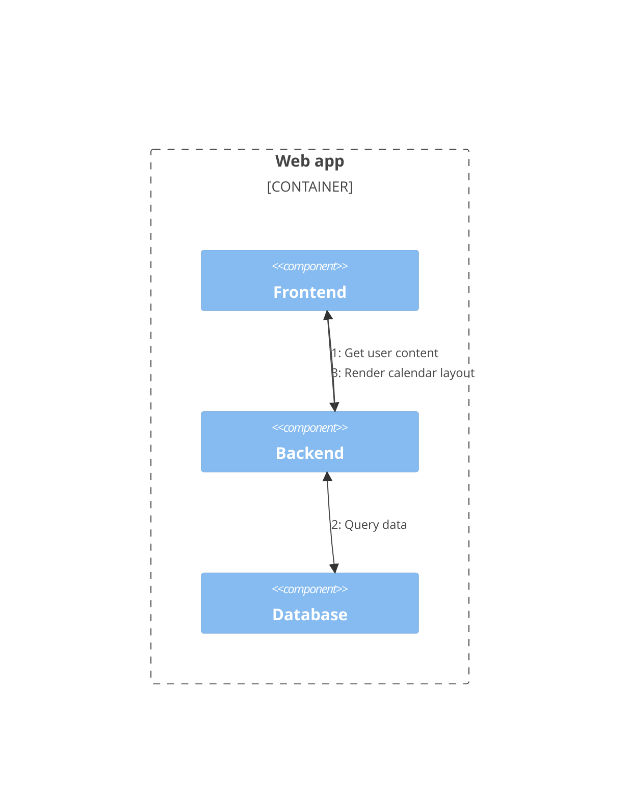
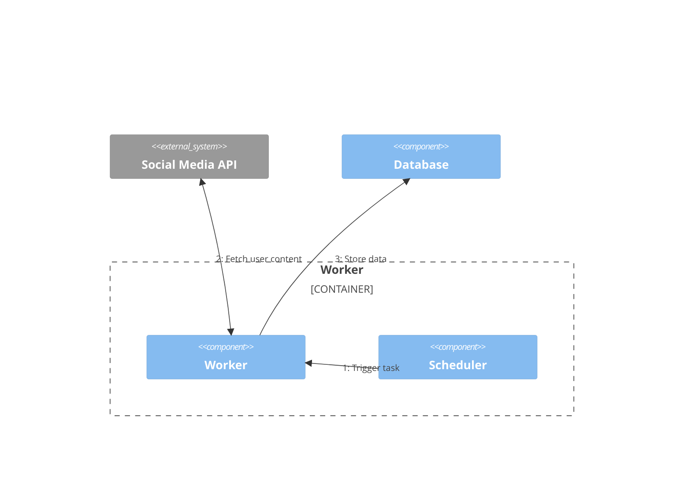
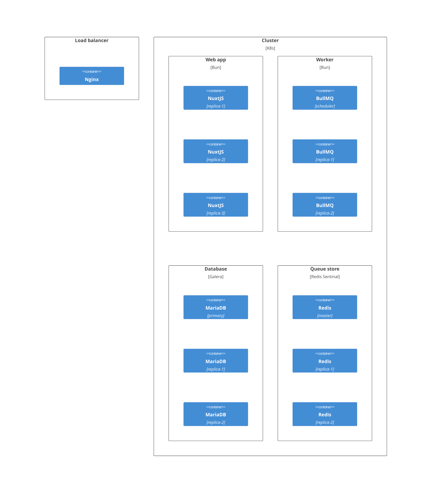
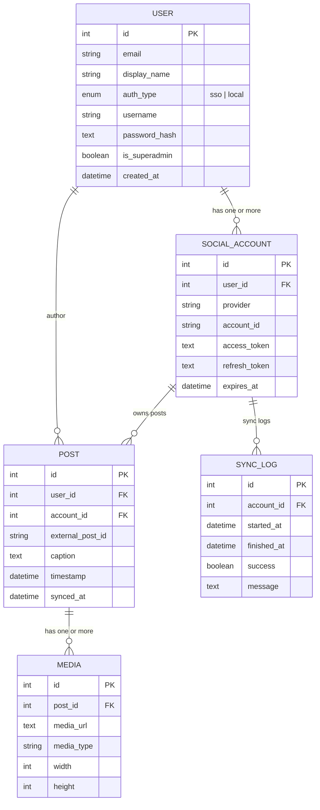

# Software Design Specification

## Context Diagram

## Container Diagram

## Component Diagram

## Dynamic Diagram

### User auth

### Calendar grid

### Content syncer

## Deployment Diagram

## Entity Relationship Diagram

