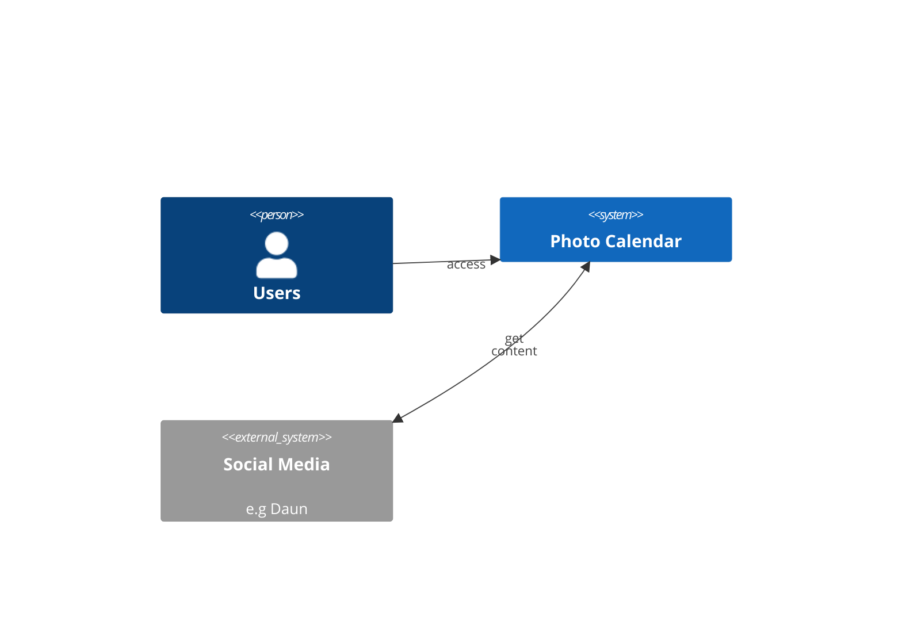
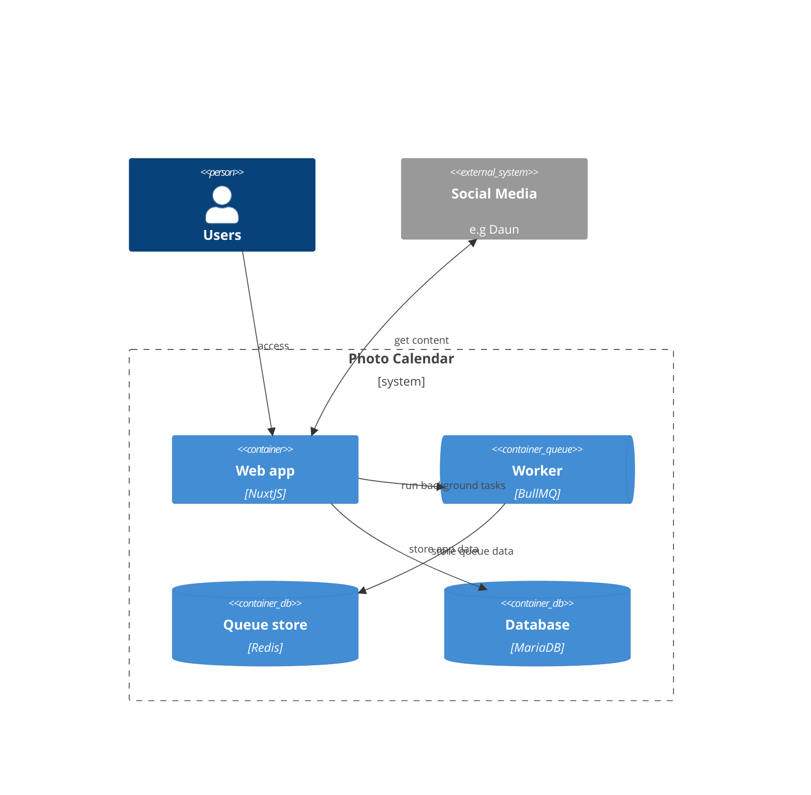
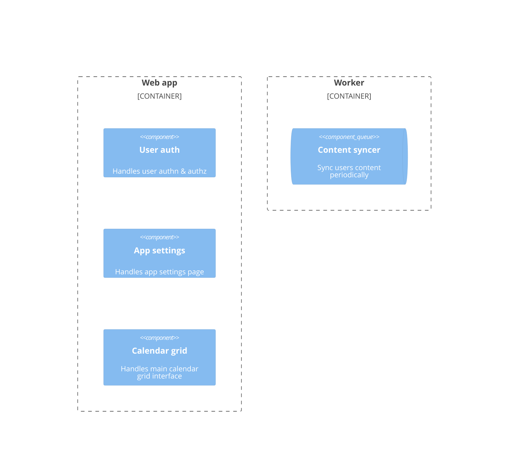
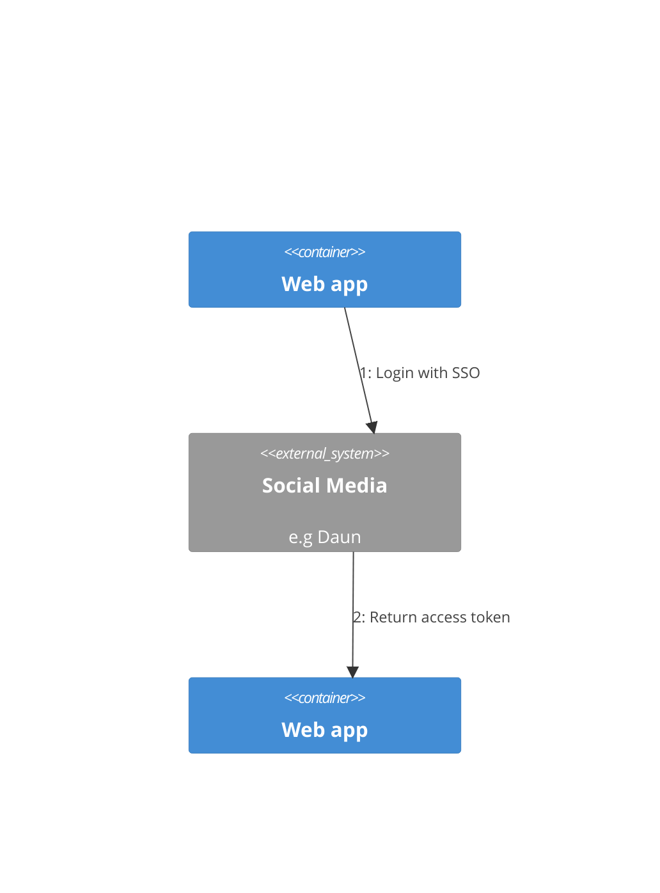
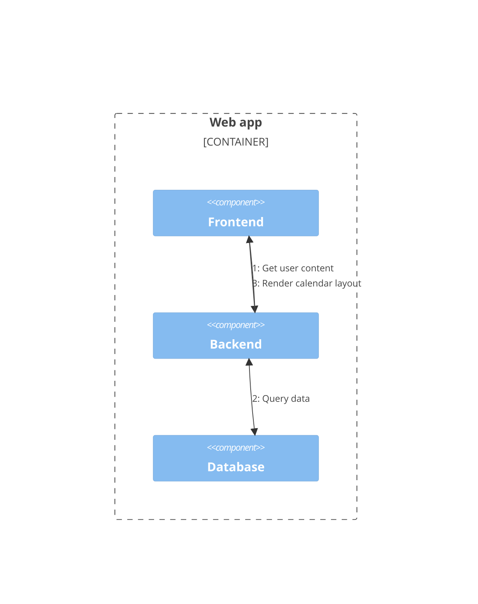
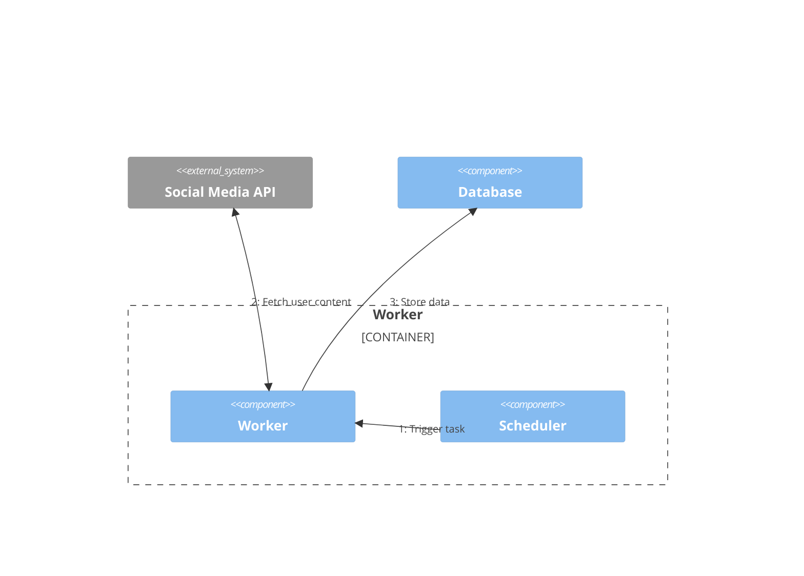
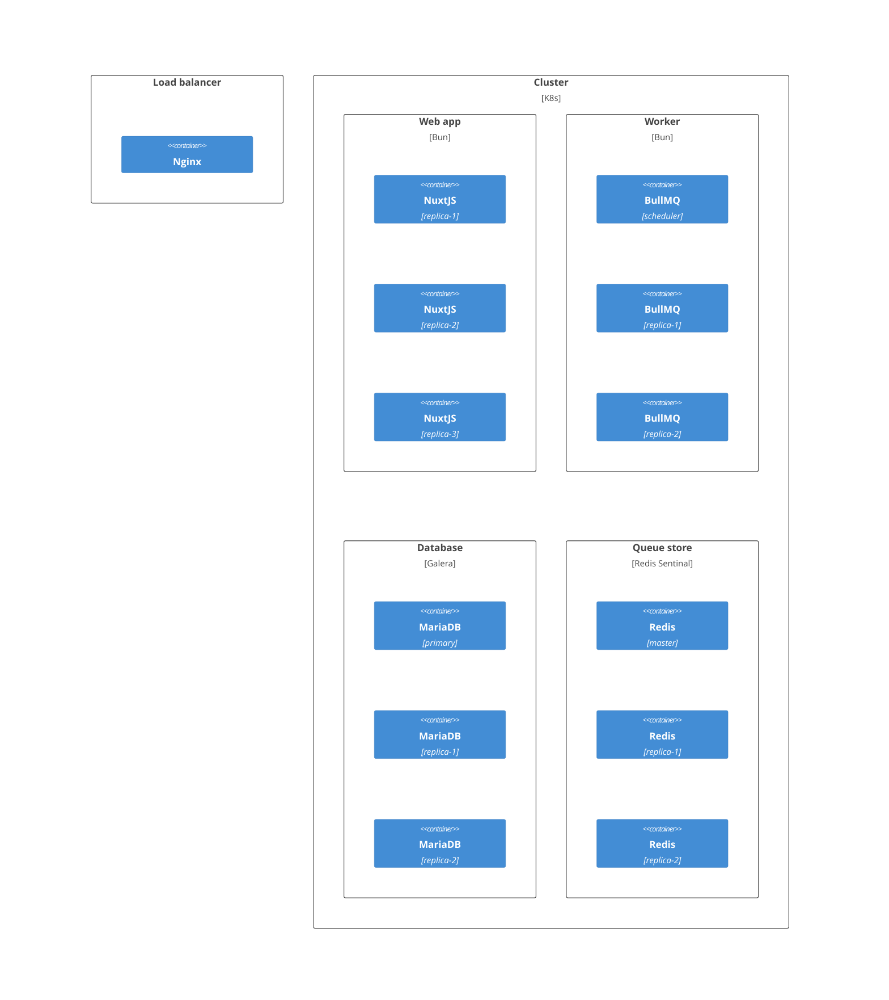
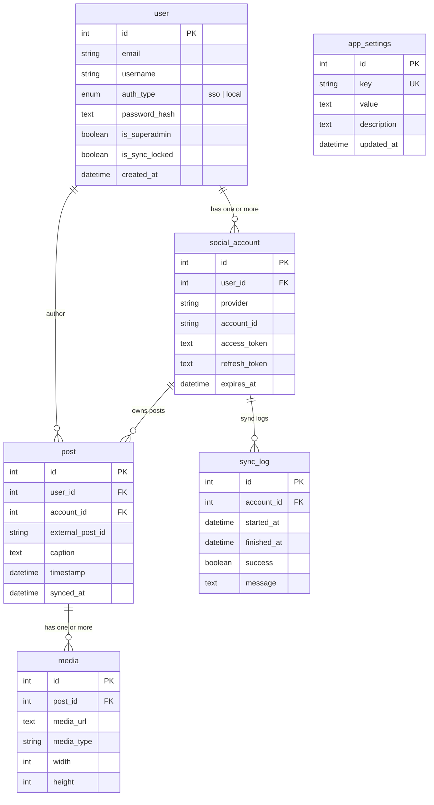

# Software Design Specification

## Context Diagram

```mermaid
C4Context
Person(users, "Users")
System(app, "Photo Calendar")
System_Ext(socmed, "Social Media", "e.g Daun")
Rel(users, app, "access")
BiRel(app, socmed, "get<br>content")
```

## Container Diagram

```mermaid
C4Container
UpdateLayoutConfig($c4ShapeInRow="3", $c4BoundaryInRow="1")
Person(users, "Users")
System_Ext(socmed, "Social Media", "e.g Daun")
Boundary(app, "Photo Calendar") {
    Container(web, "Web app", "NuxtJS")
    ContainerQueue(worker, "Worker", "BullMQ")
    ContainerDb(redis, "Queue store", "Redis")
    ContainerDb(db, "Database", "MariaDB")
}
Rel(users, web, "access")
BiRel(web, socmed, "get content")
Rel(web, db, "store app data")
Rel(web, worker, "run background tasks")
Rel(worker, redis, "store queue data")
```

## Component Diagram

```mermaid
C4Component
Container_Boundary(web, "Web app") {
    Component(ua, "User auth", "", "Handles user authn & authz")
    Component(as, "App settings", "", "Handles app settings page")
    Component(cg, "Calendar grid", "", "Handles main calendar<br>grid interface")
}
Container_Boundary(worker, "Worker") {
    ComponentQueue(cs, "Content syncer", "", "Sync users content<br>periodically")
}
```

## Dynamic Diagram

### User auth

```mermaid
C4Dynamic
UpdateLayoutConfig($c4ShapeInRow="1")
Container(web, "Web app")
System_Ext(socmed, "Social Media", "e.g Daun")
Container(web-auth, "Web app")
Rel(web, socmed, "Login with SSO")
Rel(socmed, web-auth, "Return access token")
```

### Calendar grid

```mermaid
C4Dynamic
UpdateLayoutConfig($c4ShapeInRow="1")
Container_Boundary(web, "Web app") {
    Component(fe, "Frontend")
    Component(be, "Backend")
    Component(db, "Database")
}
Rel(fe, be, "Get user content")
BiRel(be, db, "Query data")
Rel(be, fe, "Render calendar layout")
UpdateRelStyle(fe, be, $offsetY="-10")
UpdateRelStyle(be, fe, $offsetY="10")
```

### Content syncer

```mermaid
C4Dynamic
System_Ext(socmed, "Social Media API")
Container_Boundary(worker, "Worker") {
    Component(worker, "Worker")
    Component(scheduler, "Scheduler")
}
Component(db, "Database")
Rel(scheduler, worker, "Trigger task")
BiRel(worker, socmed, "Fetch user content")
Rel(worker, db, "Store data")
```

## Deployment Diagram

```mermaid
C4Deployment
Deployment_Node(lb, "Load balancer", "") {
    Container(lb, "Nginx")
}
Deployment_Node(k8s, "Cluster", "K8s") {
    Deployment_Node(nuxt, "Web app", "Bun") {
        Container(web-1, "NuxtJS", "replica-1")
        Container(web-2, "NuxtJS", "replica-2")
        Container(web-3, "NuxtJS", "replica-3")
    }
    Deployment_Node(worker, "Worker", "Bun") {
        Container(worker-1, "BullMQ", "scheduler")
        Container(worker-2, "BullMQ", "replica-1")
        Container(worker-3, "BullMQ", "replica-2")
    }
    Deployment_Node(galera, "Database", "Galera") {
        Container(db-1, "MariaDB", "primary")
        Container(db-2, "MariaDB", "replica-1")
        Container(db-3, "MariaDB", "replica-2")
    }
    Deployment_Node(sentinel, "Queue store", "Redis Sentinal") {
        Container(redis-1, "Redis", "master")
        Container(redis-2, "Redis", "replica-1")
        Container(redis-3, "Redis", "replica-2")
    }
}
```

## Entity Relationship Diagram

```mermaid
erDiagram
    user {
        int id PK
        string email
        string username
        enum auth_type  "sso | local"        
        text password_hash
        boolean is_superadmin
        boolean is_sync_locked
        datetime created_at
    }

    social_account {
        int id PK
        int user_id FK
        string provider
        string account_id
        text access_token
        text refresh_token
        datetime expires_at
    }

    post {
        int id PK
        int user_id FK
        int account_id FK
        string external_post_id
        text caption
        datetime timestamp
        datetime synced_at
    }

    media {
        int id PK
        int post_id FK
        text media_url
        string media_type
        int width
        int height
    }

    sync_log {
        int id PK
        int account_id FK
        datetime started_at
        datetime finished_at
        boolean success
        text message
    }

    app_settings {
        int id PK
        string key UK
        text value 
        text description
        datetime updated_at
    }

    %% Relationships
    user ||--o{ social_account : "has one or more"
    social_account ||--o{ post : "owns posts"
    post ||--o{ media : "has one or more"
    social_account ||--o{ sync_log : "sync logs"
    user ||--o{ post : "author"
```

## REST API Endpoints

### Authentication Flow 

`/api/auth/login` (GET)

| Aspect     | Details |
| ---------- | ------- |
| Parameters | <li>`provider` (query, required) → e.g. "google", "azuread", "keycloak" <li>`redirect_uri` (query, optional override) <li>`state` (query, generated server-side) |
| Output     | <pre>{   "message": "",   "data": {     "redirect_url": "[IdP authorization endpoint]"   } } |
| HTTP Codes | `302` (success redirect)   `400` (invalid request) |

`/api/auth/callback` (GET)

| Aspect     | Details |
| ---------- | ------- |
| Parameters | <li> `provider` (query, required) <li> `code` (query, required) <li> `state` (query, required) |
| Output     | <pre>{   "message": "",   "data": {       "access_token": "string",       "id_token": "string",       "refresh_token": "string",       "expires_in": 3600   } }</pre> |
| HTTP Codes | `200` (success)   `400` (invalid request)   `401` (token exchange failed) |

`/api/auth/token` (POST)

| Aspect     | Details |
| ---------- | ------- |
| Parameters | <li> `provider` (body, required) <li> `grant_type`: "`authorization_code`" or "`refresh_token`" <li> `code` (if grant_type=authorization_code) <li> `refresh_token` (if grant_type=refresh_token) |
| Output     | Same as `/api/auth/callback` |
| HTTP Codes | `200` (success)   `400` (invalid grant_type)   `401` (invalid token) |

`/api/auth/refresh` (POST)

| Aspect     | Details |
| ---------- | ------- |
| Parameters | <li> `provider` (body, required) <li> `refresh_token` (required) |
| Output     | <pre>{   "message": "",   "data": {      "access_token": "string",      "expires_in": 3600   } } |
| HTTP Codes | `200` (success)   `401` (invalid/expired refresh token) |

`/api/auth/logout` (GET, POST)

| Aspect     | Details |
| ---------- | ------- |
| Parameters | <li> `provider` (query or body, required) <li> `id_token_hint` (optional) |
| Output     | <pre>{   "message": "Logged out" } |
| HTTP Codes | `200` (success), `400` (invalid request) |

`/api/auth/userinfo` (GET)

| Aspect     | Details |
| ---------- | ------- |
| Parameters | <li> `Authorization: Bearer` (header, required) <li> `provider` (query, optional — backend can auto‑detect from `iss` claim in token) |
| Output     | <pre>{   "message": "",   "data": {       "sub": "user-id",       "name": "John Doe",       "email": "johndoe@example.com",       "roles": ["admin", "user"]   } } |
| HTTP Codes | `200` (success)   `401` (invalid/expired token) |

### Session & Token Management

`/api/session` (GET)

| Aspect     | Details |
| ---------- | ------- |
| Parameters | <li> `Authorization: Bearer` (header, required) <li> `provider` (query, optional — backend can auto‑detect from `iss`) |
| Output     | <pre>{   "message": "",   "data": {       "user": {         "id": "123",         "username": "johndoe",         "email": "johndoe@example.com",         "is_superadmin": false       },     "expires_at": "2026-02-23T07:22:00Z"   } } |
| HTTP Codes | `200` (success)   `401` (no active session) |

`/api/session/validate` (POST)

| Aspect     | Details |
| ---------- | ------- |
| Parameters | <li> `token` (body, required) <li> `provider` (body, optional — backend can auto‑detect from `iss`) |
| Output     | <pre>{   "valid": true,   "claims": {     "sub": "123",     "exp": 1670000000   } } |
| HTTP Codes | `200` (success)   `401` (invalid token) |

`/api/session/revoke` (GET)

| Aspect     | Details |
| ---------- | ------- |
| Parameters | <li> `token` (body, required) <li> `provider` (body, optional — backend can auto‑detect from `iss`) |
| Output     | <pre>{   "message": "Token revoked" } |
| HTTP Codes | `200` (success)   `400` (invalid request) |

### Users

`/api/users/` (GET)

| Aspect     | Details |
| ---------- | ------- |
| Parameters | <li> `Authorization: Bearer` (header, required) <li> `page` (int, optional, default: 1) → pagination page number <li> `limit` (int, optional, default: 100) → number of posts per page <li> `filter` (JSON string, optional)  → filter by this column: <pre>{   "$column": {     "value": "", // required if min & max below not specified & vice versa     "cmp": "", // '=', '!=', '>', '>=', '<', '<=', default: '='     "min": "",     "max": ""   } }</pre> `$column`: email, username, is_superadmin, is_sync_locked <li> `sort` (string, optional: asc/desc, default: desc) <li> `sort_by` (string, optional, default: id) → sort by this column |
| Output     | <pre>{    "page": 1,   "limit": 10,   "total": 125,   "users": [     {       "id": 101,       "email": "johndoe@example.com",       "username": "johndoe",       "auth_type": "sso",       "is_superadmin": false,       "is_sync_locked": false,       "created_at": "2026-02-20T18:30:00Z",     }   ] } |
| HTTP Codes | `200` (success)   `400` (invalid request)   `401` (unauthorized)   `404` (no users found)   `500` (internal server error) |

`/api/users/{id}` (GET)

| Aspect     | Details |
| ---------- | ------- |
| Parameters | <li> `Authorization: Bearer` (header, required) <li> `id` (int) → Unique identifier of the post |
| Output     | <pre>{   "message": "",   "user": {     "id": 101,     "email": "johndoe@example.com",     "username": "johndoe",     "auth_type": "sso",     "is_superadmin": false,     "is_sync_locked": false,     "created_at": "2026-02-20T18:30:00Z",   } } |
| HTTP Codes | `200` (success)   `400` (invalid request)   `401` (unauthorized)   `404` (no users found)   `500` (internal server error) |

`/api/users/{id}` (PUT)

| Aspect     | Details |
| ---------- | ------- |
| Parameters | <li> `Authorization: Bearer` (header, required) <li> `id` (query, required) → user ID <li> JSON Body: <pre>{   "username": "johndoe",   "is_sync_locked": true } |
| Output | <pre>{   "message": "",   "user": {     "id": 101,     "email": "johndoe@example.com",     "username": "johndoe",     "auth_type": "sso",     "is_superadmin": false,     "is_sync_locked": false,     "created_at": "2026-02-20T18:30:00Z",   } } |
| HTTP Codes | `200` (success)   `400` (invalid request)   `401` (unauthorized)   `404` (not found)   `500` (internal server error) |

`/api/users/{id}` (DELETE)

| Aspect     | Details |
| ---------- | ------- |
| Parameters | <li> `Authorization: Bearer` (header, required) <li> `id` (query, required) → user ID |
| Output     | <pre>{   "message": "User 'johndoe@example.com' deleted successfully."  } |
| HTTP Codes | `200` (success)   `400` (invalid request)   `401` (unauthorized)   `404` (not found)   `500` (internal server error) |

### Posts

`/api/posts` (GET)

| Aspect     | Details |
| ---------- | ------- |
| Parameters | <li> `Authorization: Bearer` (header, required) <li> `page` (int, optional, default: 1) → pagination page number <li> `limit` (int, optional, default: 100) → number of posts per page <li> `from_timestamp` (datetime, optional) → filter posts newer than this timestamp <li> `to_timestamp` (datetime, optional) → filter posts older than this timestamp <li> `sort` (string, optional: asc/desc, default: desc) <li> `sort_by` (string, optional, default: id) → sort by this column |
| Output     | <pre>{    "page": 1,   "limit": 10,   "total": 125,   "posts": [     {       "id": 101,       "external_post_id": "fb_12345",       "caption": "Sunset view!",       "timestamp": "2026-02-20T18:30:00",       "account_id": 5,       "media": [         {           "id": 501,           "media_url": "https://cdn.app/photos/sunset.jpg",           "media_type": "photo",           "width": 1080,           "height": 720         }       ]     }   ] } |
| HTTP Codes | `200` (success)   `400` (invalid request)   `401` (unauthorized)   `404` (no posts found)   `500` (internal server error) |

`/api/posts/{id}` (GET)

| Aspect     | Details |
| ---------- | ------- |
| Parameters | <li> `Authorization: Bearer` (header, required) <li> `id` (int) → Unique identifier of the post |
| Output     | <pre>{   "message": "",   "post": {     "id": 101,     "external_post_id": "fb_12345",     "caption": "Sunset view!",     "timestamp": "2026-02-20T18:30:00Z",     "account_id": 5,     "media": [       {         "id": 501,         "media_url": "https://cdn.app/photos/sunset.jpg",         "media_type": "photo",         "width": 1080,         "height": 720       },       {         "id": 502,         "media_url": "https://cdn.app/photos/sunset2.jpg",         "media_type": "photo",         "width": 640,         "height": 480       }     ]   } } |
| HTTP Codes | `200` (success)   `400` (invalid request)   `401` (unauthorized)   `404` (no posts found)   `500` (internal server error) |

### App Settings

`/api/settings` (GET)

| Aspect     | Details |
| ---------- | ------- |
| Parameters | <li> `Authorization: Bearer` (header, required) <li> `page` (int, optional, default: 1) → pagination page number <li> `limit` (int, optional, default: 100) → number of settings per page |
| Output     | <pre>{    "page": 1,   "limit": 10,   "total": 125,   "settings": [     {       "key": "sync.interval_minutes",       "value": "30", "description": "Interval for background sync jobs",       "updated_at": "2026-02-22T10:00:00Z"     }   ] } |
| HTTP Codes | `200` (success)   `400` (invalid request)   `401` (unauthorized)   `500` (internal server error) |

`/api/settings/{key}` (GET)

| Aspect     | Details |
| ---------- | ------- |
| Parameters | <li> `Authorization: Bearer` (header, required) <li> `key` (query, required) → app setting key |
| Output     | <pre>{   "message": "",   "setting": {     "key": "sync.interval_minutes",     "value": "30",     "description": "Interval for background sync jobs",     "updated_at": "2026-02-22T10:00:00Z"    } } |
| HTTP Codes | `200` (success)   `400` (invalid request)   `401` (unauthorized)   `404` (not found)   `500` (internal server error) |

`/api/settings` (POST)

| Aspect     | Details |
| ---------- | ------- |
| Parameters | <li> `Authorization: Bearer` (header, required) <li> JSON body: <pre>{   "key": "upload.max_size_mb",   "value": "50",   "description": "Maximum media upload size" } |
| Output     | <pre>{   "message": "",   "setting": {     "key": "upload.max_size_mb",     "value": "50",     "description": "Maximum media upload size",     "updated_at": "2026-02-23T07:30:00Z"    } } |
| HTTP Codes | `201` (created)   `400` (invalid request)   `401` (unauthorized)   `500` (internal server error) |

`/api/settings/{key}` (PUT)

| Aspect     | Details |
| ---------- | ------- |
| Parameters | <li> `Authorization: Bearer` (header, required) <li> `key` (query, required) → app setting key <li> JSON Body: <pre>{   "value": "60",   "description": "Updated sync interval" } |
| Output | <pre>{   "message": "", "setting": {     "key": "sync_interval_minutes",     "value": "60",     "description": "Updated sync interval",    "updated_at": "2026-02-23T07:35:00Z"   } } |
| HTTP Codes | `200` (success)   `400` (invalid request)   `401` (unauthorized)   `404` (not found)   `500` (internal server error) |

`/api/settings/{key}` (DELETE)

| Aspect     | Details |
| ---------- | ------- |
| Parameters | <li> `Authorization: Bearer` (header, required) <li> `key` (query, required) → app setting key |
| Output     | <pre>{   "message": "Setting 'sync_interval_minutes' deleted successfully." } |
| HTTP Codes | `200` (success)   `400` (invalid request)   `401` (unauthorized)   `404` (not found)   `500` (internal server error) |

## Worker Tasks

- worker component is implemented using BullMQ library, with redis as message broker
- it receives tasks from 'web' component via redis, and return output via REST API back to 'web'
- worker component has 2 roles: runner & scheduler. 
  - scheduler: handle scheduling of tasks
  - runner: run the task
- both subcomponent use same code base inside 'worker' folder, and started using specific flag

### Content Syncer

- triggered via scheduled cron job, run every 2 minutes
- purpose: sync users' social media API photos metadata
- algorithm:
  - sort non-superadmin, unlocked users by last sync datetime, sort oldest first or never sync first, get top 5 users, then lock the user for sync process
  - perform request to social media API & update photos data via REST API to web component
  - auto retry with graceful backoff in case of failure, retry max 3 times
  - when finish, regardless success or failed, unlock users